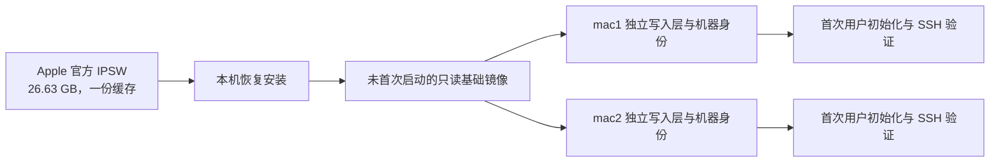

# Farrow Mac：两个固定槽位的 macOS 开发环境

日期：2026-09-21。源码基线：`1c054a027420b5410c6f6feb344e27e001ae1af1`。

**建议采用独立的 `farrow mac` 命令域，固定 `mac1`、`mac2` 两个槽位，默认 macOS 27 Golden Gate。默认提供与宿主同名的管理员账户、SSH 密钥登录、免密 sudo、本地桌面自动登录，以及独立私网中的两个预留 IP。**

这是产品与实现方案，文中的新命令均为拟议接口，当前 Farrow 尚未实现。它取代[前一份可行性报告](MACOS-VM-RESEARCH-20260921.md)中“共用 inventory 和 Linux 生命周期”的建议；前一份报告中的平台、开源项目和许可取证仍可参考。

本轮新增两类实测：Apple CDN 分段下载测速；Swift 对 DHCP 预留配置和 ASIF 基础盘加两个写入层的 API 探测。没有下载完整 IPSW、安装或启动 macOS VM，也没有修改 Farrow 运行代码。

## 1. 产品边界与默认值

| 项目 | 首版建议 |
|---|---|
| 入口 | `farrow mac`；不带子命令等同 `farrow mac ls` |
| 宿主 | Apple Silicon、macOS 27；Linux / Intel Mac 上给出明确的不支持原因 |
| 客户机 | macOS 27 Golden Gate；当前锁定 27.0 / 26A428，不提供发行版选择菜单 |
| 槽位 | `mac1`、`mac2`；接受 `1`、`2` 简写；不支持随意增加第三个名字 |
| 默认目标 | 省略目标时始终是 `mac1`，不根据谁正在运行而改变 |
| 资源 | 每台 4 vCPU、8 GiB 内存、100 GiB 逻辑系统盘；由稀疏文件按需占用宿主磁盘 |
| 启动行为 | 默认只启动所选槽位；第二台显式执行 `up mac2` |
| 用户 | 宿主实际调用用户的短用户名，例如 `vonng`，创建客户机本地管理员账户 |
| 权限 | 用户正常登录；免密 `sudo`；root 保持默认禁用直接登录的状态 |
| 访问 | SSH 默认开启；首次初始化后使用密钥；`open` 打开原生桌面窗口 |
| 桌面 | 默认自动登录客户机本地用户；默认不弹窗口，需要时 `open` |
| Apple Account | 不登录、不复制宿主账户与凭据 |
| 网络 | 独立 shared/NAT 私网、两个 DHCP 预留地址，不依赖 Linux 的 socket_vmnet 网络 |
| 数据 | `$FARROW_HOME/mac/`，默认 `~/.farrow/mac/`；独立状态格式、锁、缓存、凭据引用 |

资源值是产品默认值，不是 Apple 的最低要求。本机恢复镜像 API 返回最低 2 vCPU / 4 GiB。两台各 8 GiB 加上宿主工作负载，建议 32 GiB 或更大内存；内存较小的机器允许降低单台配置，但要满足 Apple 要求。磁盘初始配置可以调整，增长虚拟设备容量还必须扩容客户机 APFS，首版不提供缩盘。

两个槽位是 Farrow 的产品模型。Apple 许可条件和系统运行额度作用于整台宿主，其他工具运行的 macOS VM 也可能占用额度。Farrow 不能承诺“始终额外启动两台”，也不应为了自己的启动而停止 UTM/Lume 的 VM。Apple 提供 `virtualMachineLimitExceeded` 错误，应将其转换为用户能采取行动的提示。[Apple 运行限制错误](https://developer.apple.com/documentation/virtualization/vzerror/code/virtualmachinelimitexceeded)、[macOS 27 许可](https://www.apple.com/legal/sla/docs/macOS27.pdf)

## 2. 使用体验与命令语义

日常入口只需要：

```console
farrow mac up                 # 自动完成缺少的准备，并使 mac1 可用
farrow mac up mac2            # 创建并启动第二台
farrow mac ls
farrow mac ssh mac1
farrow mac exec mac1 -- sw_vers
farrow mac open mac1          # 打开客户机桌面
farrow mac stop mac1
```

示意输出，下列状态和地址不是已创建的机器：

```text
NAME  STATE    IP            USER   OS                 CPU  MEMORY
mac1  ready    10.10.20.10   vonng  27.0 (26A428)        4    8 GiB
mac2  empty    10.10.20.11   —      —                    —    —

mac2: address reserved; run `farrow mac up mac2` to create it.
```

`ls` 始终显示两个槽位。首次 setup 之前 IP 显示 `—`，不因读取状态就下载镜像、创建网络或占用内存。已预留 IP 不表示该地址当前在线。`running` 只表示 VM 正在执行，`ready` 才表示客户机初始化及 SSH 验证完成。

将显式准备入口保留下来，便于预下载和排查，但不要求用户按顺序手工调用：

| 命令 | 精确定义 |
|---|---|
| `mac setup` | 检查宿主、准备 helper 和网络配置、下载固定 build 的 IPSW、制作基础镜像。完成后不启动用户槽位；重复执行幂等 |
| `mac init mac1` | 确保基础镜像可用，创建槽位配置、身份和写入层；停在 `created`，尚未执行首次客户机启动；已有槽位不覆盖 |
| `mac up mac1` | 缺什么补什么；创建、启动、首次配置、验证 SSH；完成后为 `ready`。再次执行不重装、不换版本、不清除用户修改 |
| `mac start mac1` | 仅启动已有且完成初始化的实例；不存在或尚未初始化时提示执行 `up`，不隐含下载与创建 |
| `mac stop mac1` | 请求正常关机，保留盘和配置；超时报告错误，强制断电需要显式 `--force` |
| `mac reset mac1` | 用该实例所记录的基础版本重新创建，清除客户机修改，保留槽位名字/IP/资源偏好，生成新机器身份 |
| `mac destroy mac1` | 删除槽位实例并恢复 `empty`，保留名字/IP 预留和共享基础镜像 |
| `mac doctor` | 检查宿主 API、helper 签名、网络权限/路由、磁盘、状态和 SSH；区分问题在哪个阶段 |

`reset` / `destroy` 要明确显示目标与数据范围，符合 Farrow 既有破坏性命令约定；不引入“重跑 init 自动清盘”。`ssh` / `exec` / `open` 不替用户下载或创建机器，离线时提示 `up`。

`open` 只是展示已有 VM 的窗口；关窗口不关 VM，VM 不随发起命令的终端退出。首版承诺“用户已登录宿主后的后台运行”。宿主重启后无人登录、锁定 Keychain 和无人值守 CI 是另一个验收场景，不直接套用 Linux 守护进程的结论。

全局 `--json` 可以复用，`mac ls --json` 返回固定两项及全局准备状态。Mac 命令不读取当前目录的 `farrow.yml`；原有 Linux `status/stop/destroy/purge` 的作用范围必须保持明确，不递归误删新增的 `mac/` 数据。

## 3. 网络：固定两个地址，用 DHCP 下发

建议创建专用网络，首选 `10.10.20.0/24`，预留：

| 对象 | 首选地址 / 标识 |
|---|---|
| 宿主侧网关 | `10.10.20.1`，以 vmnet 创建后查询结果核实 |
| mac1 | `10.10.20.10`；独立且稳定的虚拟网卡 MAC |
| mac2 | `10.10.20.11`；另一独立且稳定的虚拟网卡 MAC |
| SSH 入口 | `farrow mac ssh mac1`；生成的 SSH 配置可提供 `farrow-mac1` / `farrow-mac2` 别名 |

地址在本机第一次 setup 后固定，并非所有用户机器必须硬编码同一个网段。setup 检查 LAN、VPN、当前 Farrow Linux 网络和已有 vmnet 的路由占用；首选冲突时从一小组私网候选中选出不冲突网段并持久化。无法选出时允许显式指定 `--subnet`。后续 VPN 引起冲突要明确报错，不能悄悄给运行中的 VM 换 IP。

实现使用 `VZVmnetNetworkDeviceAttachment` 与 vmnet 的 shared 模式，在网络配置中按 MAC 设置两个 DHCP reservation。客户机继续使用正常 DHCP，网关/DNS 随租约下发，不必先远程登录才能配静态 IP。[Apple 网络附件](https://developer.apple.com/documentation/virtualization/vzvmnetnetworkdeviceattachment)、[DHCP 预留接口](https://developer.apple.com/documentation/vmnet/vmnet_network_configuration_add_dhcp_reservation(_:_:_:))

Apple 不允许在网络活动时修改 reservation，因此在创建网络时把两个槽位的预留一并配置，即使第二个槽位还是空的。槽位 MAC 从本次 Farrow 安装身份生成并保存，不能把同一对常量 MAC 发给所有用户。reset 保留槽位 MAC/IP，但更新实例 UUID、Apple machineIdentifier 和 SSH 信任身份。

**本机已验证配置接口可接受该 /24 网段及 `.10`、`.11` 两个 DHCP 预留，均返回 `VMNET_SUCCESS`。没有启动网络，也没有验证实际租约、路由和双 VM 互通。**

网络对用户的承诺应直接写清楚：

| 连接方向 | 首版约定 |
|---|---|
| 宿主 ↔ mac1/mac2 | 可以访问 IP、SSH 和客户机监听的开发服务；客户机防火墙规则仍然适用 |
| mac1 ↔ mac2 | 同一专用子网，可以互通 |
| 客户机 → 公网 | 通过宿主 NAT 出网和 DNS 代理，不需另配桥接 |
| 局域网其他电脑 → 客户机 | 默认不做桥接或端口发布，不自动把客户机服务暴露到 LAN |
| Mac VM ↔ 现有 Linux VM | 不作为首版自动互通契约；独立网段并不等于有安全隔离防火墙，实际可达性另测 |
| 宿主代理 / VPN | HTTP 代理设置不会因 NAT 自动复制给客户机；不同 VPN 的隧道路由与过滤策略需要实测 |

用户日常不必记 IP；`farrow mac ssh` 总是读取本机已保存的地址。SSH 别名由 Farrow 自己的配置片段提供，不要求修改 `/etc/hosts`。macOS 的 `LocalHostName` 可以设为 `farrow-mac1`，但不能把 mDNS `.local` 当作唯一的管理地址来源。

### 网络实现中要优先验证的约束

自定义 vmnet 涉及权限。`com.apple.vm.networking` 是受限 entitlement，不能假设在二进制中写入这个键就能获得发布权限。[Apple entitlement 说明](https://developer.apple.com/documentation/bundleresources/entitlements/com.apple.vm.networking)

工程上优先验证受签名授权的用户态 runner；没有相应授权时，验证小型特权网络 helper 路径，VM 和 GUI 仍由普通用户运行。Apple 提供 XPC 网络对象序列化/重建接口，但 VZ 要求使用属于本进程的网络对象，跨权限进程转交必须实测。如果该路径无法满足权限约束，再用特权 vmnet helper 转发数据报；不能把现有 QEMU 的流式 socket 直接交给 VZ。[网络对象跨进程接口](https://developer.apple.com/documentation/vmnet/vmnet_network_create_with_serialization(_:_:))

这应在 UI 完善前验证。`VZNATNetworkDeviceAttachment` 可以做初始启动实验，但如果不能控制地址，就不能作为“固定 IP 产品已完成”的验收结果。首次需要管理员授权的宿主准备应集中在 setup 中，日常 `up/ssh/open` 不应整体以 root 运行。

## 4. 用户与 SSH：普通管理员，拥有 root 操作能力

默认使用宿主短用户名，例如 `vonng`；只继承用户名，可选继承显示名，不复制宿主 UID、密码、SSH 私钥或 Keychain。若调用者是 root、系统保留名或不合法名字，默认使用 `farrow`，也可在首次 `init` 明确 `--user`。首版支持本地账户，不接目录服务账户。

不把 root 当作主要账户，理由是 macOS 日常工具链与会话模型：Homebrew 的常规安装与包管理需要普通用户，桌面、用户目录和登录 Keychain 也应属于正常本地用户。Apple 默认禁用 root，并提供 sudo 路径。[Homebrew FAQ](https://docs.brew.sh/FAQ#why-does-homebrew-say-sudo-is-bad)、[Apple root 账户说明](https://support.apple.com/en-us/102367)

建议的默认体验：

```console
farrow mac ssh mac1
# 登录为 vonng，无需输入 SSH 密码

sudo -i
# 进入 root shell，无需输入 sudo 密码

farrow mac exec mac1 -- sudo /usr/sbin/softwareupdate --list
```

Golden Gate 的 `VZMacGuestProvisioningOptions` 可以在恢复安装后的首次启动设置用户名、密码、自动登录和 Remote Login。它没有 `authorized_keys`、任意初始化脚本和完整用户管理的字段；已经初始化过的磁盘不会被这组参数重新配置。[Apple 首次初始化 API](https://developer.apple.com/documentation/virtualization/vzmacguestprovisioningoptions)

完整初始化应为：

1. 为该实例生成随机密码，保存到宿主 Keychain；创建它自己的 SSH 客户端密钥，或使用明确指定的宿主公钥。私钥留在宿主，默认不转发 SSH agent。
2. 首次启动传入普通账户、`enablesRemoteLogin = true`、`logsInAutomatically = true`；不设置 Apple Account。
3. 验证 VM 进程身份和 DHCP 地址归属，用随机密码进行本地首次 SSH 引导；首连 host key 只对这个新实例进行受控登记，之后固定校验。不能把 IP/MAC 关联说成已有密码学服务器身份认证。
4. 检查账户具有管理员权限，安装 SSH 公钥、配置免密 sudo、设置主机名和必要的开发环境电源策略。
5. 用新密钥重新连接，验证实际账户、OS build、sudo 和命令返回；成功后关闭 SSH 的口令及 keyboard-interactive 登录，保留 GUI 本地密码用于设置对话框。
6. 保存 readiness；初始化失败要保留可诊断的实例和凭据，允许 `up` 重试未完成步骤。API 已经过了首次启动时，不能靠再次传 provisioning 参数修复用户配置。

凭据不写进 argv、普通日志或 JSON 输出。可提供 `mac password mac1` 显式读取 GUI 密码；它不是日常登录必经步骤。关闭窗口不退出客户机桌面会话。自动登录不等于授予 Accessibility、Screen Recording 等权限；需要 GUI 自动化的软件仍走客户机自己的授权流程。

默认底座只做可登录、可控制的纯净 macOS。Homebrew、Command Line Tools、Xcode 和测试软件是后续显式安装项，避免第一次创建就触发额外的大规模下载。首次不设置 FileVault；若用户随后启用，自动登录及无人值守启动的行为需要重新评估。

## 5. 镜像大小与下载速度：实测和未知分别列出

### 恢复安装包

来源为本机 `VZMacOSRestoreImage.latestSupported` 返回的 Apple 官方 URL，随后核实 HTTP 长度：

| 项目 | 实测 |
|---|---|
| 系统 | macOS 27.0 / 26A428 |
| IPSW 长度 | **26,626,436,228 字节 = 26.63 GB = 24.80 GiB** |
| 官方下载 | [UniversalMac_27.0_26A428_Restore.ipsw](https://updates.cdn-apple.com/2026FallFCS/afcfc88e-bbe6-44bf-a5da-07c56eebc06c/UniversalMac_27.0_26A428_Restore.ipsw) |
| Range | HEAD 声明支持；实际三个请求均返回 HTTP 206 和正确的 Content-Range |

### 当前宿主链路测速

2026-09-21 12:40，中国标准时间，依次取文件偏移 0、512 MiB、2 GiB 处各 64 MiB，共传输 192 MiB，内容写入 `/dev/null`，不保留大文件：

| 样本 | 用时 | 平均速度，十进制 MB/s |
|---|---:|---:|
| 文件开头 64 MiB | 2.106 秒 | 31.86 |
| 512 MiB 处 64 MiB | 2.016 秒 | 33.29 |
| 2 GiB 处 64 MiB | 1.830 秒 | 36.67 |
| 合计 / 加权平均 | 5.952 秒 | **33.83** |

按样本外推，完整安装包约 **12.1–13.9 分钟**，加权平均约 **13.1 分钟**。这是当前电脑、当前网络的小样本结果，尚未验证持续 26.63 GB 的速度，不能当作所有用户的下载 SLA。恢复安装、首次启动及初始化还要额外耗时，本轮未测。

作为纯传输量计算：10 MB/s 约 44.4 分钟，30 MB/s 约 14.8 分钟，60 MB/s 约 7.4 分钟；这些是算术估计，不是额外实测。

证据：[宿主和镜像元数据](/Users/vonng/.codex/visualizations/2026/09/21/01a0c223-b874-7512-a4cb-6329d0df9ecf/macos-vm-research/host-probe.json)、[分段测速记录](/Users/vonng/.codex/visualizations/2026/09/21/01a0c223-b874-7512-a4cb-6329d0df9ecf/macos-vm-research/download-speed.json)。

### 实际磁盘占用

必须区分三笔账：IPSW 下载缓存、安装好的基础镜像、两台实例各自的新增数据。**100 GiB 是每台客户机看到的逻辑磁盘容量，不是创建时立刻占用 100 GiB；26.63 GB 是下载包大小，也不是安装后的系统盘占用。**

本轮额外创建了一个空的 100 GiB ASIF 基础盘和两个独立 overlay，三份文件分别只分配了 4 MiB，并成功同时构造两个 VZ 磁盘附件。这证明当前 SDK/宿主支持该稀疏分层组合；空盘数据不能用来估计安装 macOS 后的大小。

安装后基础盘的真实物理占用、恢复过程的峰值空间、第一次启动新增多少数据，仍需要完整安装实测。预算上建议首次试用预留约 100 GiB 空闲，两台长期开发可从 150–200 GiB 空闲空间规划，并随 Xcode、SDK、构建缓存调整；这不是已测最低值或保证足够的硬阈值。

产品应显示逻辑容量、基础镜像占用、各写入层占用及宿主可用空间。使用 APFS 克隆时不能直接相加文件的 allocated size 作为独占物理空间；共享块会重复计数。宿主可用空间变化是验证整体开销的必要证据。

## 6. 下载一次、安装一次、分别初始化两台

推荐的数据流程：



IPSW 不是能直接启动的 cloud image。先由 `VZMacOSInstaller` 将其安装为系统磁盘；保存恢复完成、尚未首次启动的状态，避免把具体用户、密码或已使用的 SSH host key 烘焙到基础镜像中。[Apple 安装流程](https://developer.apple.com/documentation/virtualization/running-macos-in-a-virtual-machine-on-apple-silicon)

在宿主固定 macOS 27 的前提下，建议使用 **一个只读 ASIF base + 每个槽位一个 ASIF overlay**，保持两层，不做任意深度的快照链。DiskImageKit 已提供分层磁盘与 VZ 对接 API，本机空盘探测通过；真实恢复安装、双机同时写入、重启后重建磁盘链仍是实现验收项。[Apple DiskImageKit](https://developer.apple.com/documentation/diskimagekit)

每台必须有独立的辅助存储副本和 Apple machineIdentifier；同一实例重启保留原身份，重建则换身份。基础模板使用兼容的硬件模型，运行时不能多台共写同一个 AuxiliaryStorage，也不能仅复制系统盘就假定克隆完成。Apple 明确要求并行实例具有独立身份。[Apple Mac 平台配置](https://developer.apple.com/documentation/virtualization/vzmacplatformconfiguration)、[机器标识](https://developer.apple.com/documentation/virtualization/vzmacplatformconfiguration/machineidentifier)

该方案的产品收益是第二台无需再次下载 IPSW、无需再次执行整套恢复安装；但它仍有首次启动与用户配置时间，不能现在承诺“第二台一秒可用”。如果完整克隆验收失败，可以复用同一 IPSW 对各槽位分别恢复安装；此时必须如实说明只省下载，尚未省安装。

基础镜像完成后不可再改写。DiskImageKit 会校验层之间的 UUID 关系，更新系统时在新目录创建新基础镜像，不能在原路径覆盖正在被两个实例引用的 base。基础缓存键应包含 build、硬件模型、磁盘布局/容量和初始化配方版本；用户名不进入基础镜像。

### 下载器要求

- 直接连接 Apple 官方 HTTPS 地址；Farrow 发布元数据和配方，默认不托管或公开再分发预装 macOS 系统盘。
- 把版本固定为具体的 27.x build。`latestSupported` 只能用于发现，不能未来返回 28 时就自动改变产品承诺；配合 Farrow 的 27.x 官方链接目录和兼容检查。
- 支持 `.partial` 断点续传，核对 206、Content-Range、ETag/长度变化；服务器忽略 Range 时不能把全文件误拼到已有分片后。
- 单连接续传先做好，再考虑有界并发分段。此次单连接已达到约 34 MB/s，没有证据表明加大并发一定更快。
- 下载后用 Apple 恢复镜像 API 加载校验并检查硬件兼容。记录本地 SHA256 以验证缓存一致性；本地首次计算的摘要不能独自证明来源可信。
- 支持 `mac setup --ipsw /path/to/file.ipsw`，校验其为可用的 27.x 恢复镜像；不要求用户重新下载已有文件。
- 下载、安装、首次配置分别显示进度；网络 ETA 根据最近实际速度计算。安装阶段显示 Apple installer 的进度，不伪造分钟数。

同一 data root 同时执行两个 `up` 时，共享下载/基础镜像构建锁；第二个命令订阅同一次准备任务，不下载两份。取消下载保留可续传部分，取消恢复安装保留日志并清理不完整基础盘；下次重新恢复，不能宣称 Apple 安装过程支持任意断点继续。

制作或更新基础镜像也需要运行虚拟机安装器，必须纳入宿主 macOS VM 运行额度。两台均运行时可以下载新 IPSW，但应等待空闲额度再制作新 base，不自动关闭任何现有实例。已有可用基础镜像之前不替换默认指针。

## 7. 后续维护、更新与空间回收

| 场景 | 建议行为 |
|---|---|
| 关闭 / 重启同一台 | 保留用户、数据、Apple 身份、SSH host key；不联网重拉镜像 |
| 重新创建 mac1 | 从它记录的基础 build 重建，保持名字/IP，轮换机器身份、密码和 SSH 信任；不影响 mac2 |
| 用户在客户机内自行更新 | 允许；将观察到的运行系统版本与原始 base build 分开记录 |
| 新的 27.x 发布 | `mac image update` 显式准备新 base；不自动重装两台现有机器 |
| 使用新版创建空槽位 | 使用当前已验证的默认 base |
| 现有槽位要换新 base | 显式 `mac reset mac1 --update`，清楚说明清除客户机修改；普通 reset 仍用原 build |
| 查看缓存 | `mac image ls` 显示 IPSW、base、大小、build、引用槽位 |
| 清理安装包 | `mac image prune --installers` 删除未被进行中安装使用的 IPSW，运行中的系统盘不依赖 IPSW |
| 清理旧基础镜像 | 只删除零引用、没有构建/运行锁的 base；仍被 mac2 引用的旧 base 必须保留 |

这些镜像维护命令可以分阶段交付；首版至少必须做到固定版本、缓存复用、清理不误伤。删除 IPSW 可回收本次约 26.63 GB，但以后需重新恢复安装时可能再次下载。保留基础镜像足以支持常规 clone/reset 的目标流程，不能据此保证所有 Apple 恢复场景都完全离线。

槽位生命周期应区分 `empty → created → starting → provisioning → ready → stopped`；错误保留发生阶段和可恢复动作。基础镜像另有 `downloading / restoring / ready / failed` 状态，不能把一个全局镜像下载失败误记成两台 VM 都已损坏。

配置中的 100 GiB 不等于自动限制宿主占用永不增加。镜像层、客户机 Software Update、构建产物都会增长；宿主磁盘不足应在操作前后持续检测。暂不提供自动删除用户实例、自动清除客户机目录或深度快照管理。

## 8. 与 Farrow 现有代码的具体边界

建议新增 `cmd/farrow/mac_*` 和 `internal/macvm`，另打包一个签名的 Swift helper。Go 层负责命令、状态、下载、锁、SSH 和输出；每个 VM 的 Swift 进程负责 VZ 生命周期、安装/启动、磁盘附件和原生窗口，支持结构化 RPC 与实例身份核对。网络对象通过独立的共享网络管理路径复用，遵守前述权限和进程归属约束。

独立状态目录示意：

```text
~/.farrow/mac/
  config.json                  # 两个槽位偏好、选定子网、两个持久 MAC
  images/
    ipsw/<build>.ipsw
    base/<build-and-layout>/   # base、硬件模型、辅助存储模板、元数据
  slots/
    mac1/                      # overlay、独立辅助存储、机器 ID、状态
    mac2/
  ssh/                         # Farrow 专用密钥、实例 known_hosts、配置片段
  runtime/                     # socket、进程身份、锁、阶段日志
```

密码只保存 Keychain 引用。重建 mac1 时修改其新的 SSH 信任命名空间，不能因 IP 没变就沿用旧机器身份。共享基础镜像引用登记和槽位发布采用原子操作，两个命令并发不能创建两个同名实例。

可复用现有 Cobra/结构化输出、下载基础能力、SSH 执行和诊断经验；不要为此把现有 `internal/vm`、QMP、qcow2、cloud-init 和 Linux UID 88 抽象成一个巨大的通用框架。当前根命令的 `PersistentPreRun` 只处理 verbose，因此独立命令域不需要经过 inventory 解析；但 root help、完成脚本和全局数据清理范围仍需逐项调整。

Lume 的安装/克隆和 UTM 的 VZ/原生显示是合适的参考，UTM 当前源码也使用自定义 vmnet 子网。首版直接调用 Apple 公共 API；不把整个 Lume CLI 嵌套成第二套用户可见状态管理器，不需要它为旧 macOS 使用的离线设置补丁或私有 VNC API。[UTM 网络实现](https://github.com/utmapp/UTM/blob/10799d9f462de5a2da2e4fcaeada9fd79d3ff7c4/Services/UTMAppleVmnetNetworkManager.swift)、[Lume 克隆实现](https://github.com/trycua/cua/blob/9bbfa7dd3e27ca7f1861ede70aaca390174493f9/libs/lume/src/LumeController.swift)

## 9. 交付顺序与可以声称的完成程度

**第一步验证完整链路，第二步交付命令体验，第三步做镜像维护。** 第一阶段直接以官方 Golden Gate 跑通以下验收，不先开发复杂镜像仓库或多系统选择器：

1. 恢复安装 → 官方首次用户配置 → 无 Apple Account → SSH 密钥登录和免密 sudo → 打开桌面，记录安装耗时与物理磁盘峰值。
2. 普通用户 runner 配合正式签名/授权或特权网络 helper，两个预留地址实际生效；验证宿主、双 VM、DNS 和公网。
3. 从同一未首次启动 base 建立两个独立实例，校验用户初始化、机器身份、辅助存储、SSH host key 和写入隔离；关机后重新组装磁盘层仍可启动。
4. stop/start 保留修改；reset 只清理目标槽位且使用新身份；下载中断可续传；失败的初始化可诊断和重试。
5. 与现有 Linux VM 和 UTM 共存，触达宿主额度时正确失败；现有 Linux 全局命令不触碰 Mac 数据。

本轮已经确认的证据：

| 项目 | 证据状态 |
|---|---|
| Golden Gate 官方恢复镜像可发现、硬件模型受支持 | 本机 API 已测 |
| IPSW 大小、Range 支持、短时下载速度 | 官方 CDN 已测 |
| 用户与 SSH provisioning 参数 | Apple 文档 + 本机参数校验；客户机内效果尚未测 |
| 子网与两个 DHCP reservation 配置 | 本机 API 返回成功；网络尚未启动 |
| 100 GiB 空 ASIF base + 两个 overlay + 两个 VZ 磁盘附件 | 本机已构造；没有安装系统、执行磁盘读写隔离或 VM 启动测试 |
| 安装耗时、安装后实际占用、双机运行、固定 IP 租约、SSH/GUI 完整体验 | 待完整 VM 验收 |
| Farrow 产品命令 | 设计完成，未实现 |

新增 API 证据：[Swift 探测源码](/Users/vonng/.codex/visualizations/2026/09/21/01a0c223-b874-7512-a4cb-6329d0df9ecf/macos-vm-research/product-api-probe.swift)、[探测结果](/Users/vonng/.codex/visualizations/2026/09/21/01a0c223-b874-7512-a4cb-6329d0df9ecf/macos-vm-research/product-api-probe.json)。

产品立项建议：按“两个固定 macOS 开发环境”实现独立 `farrow mac`，把首次创建、重复启动与干净重建做好。首版的关键未知已经缩小到完整安装/克隆验收和正式网络权限路径；下载大小、当前链路速度和新 API 的配置可用性已有直接证据。
