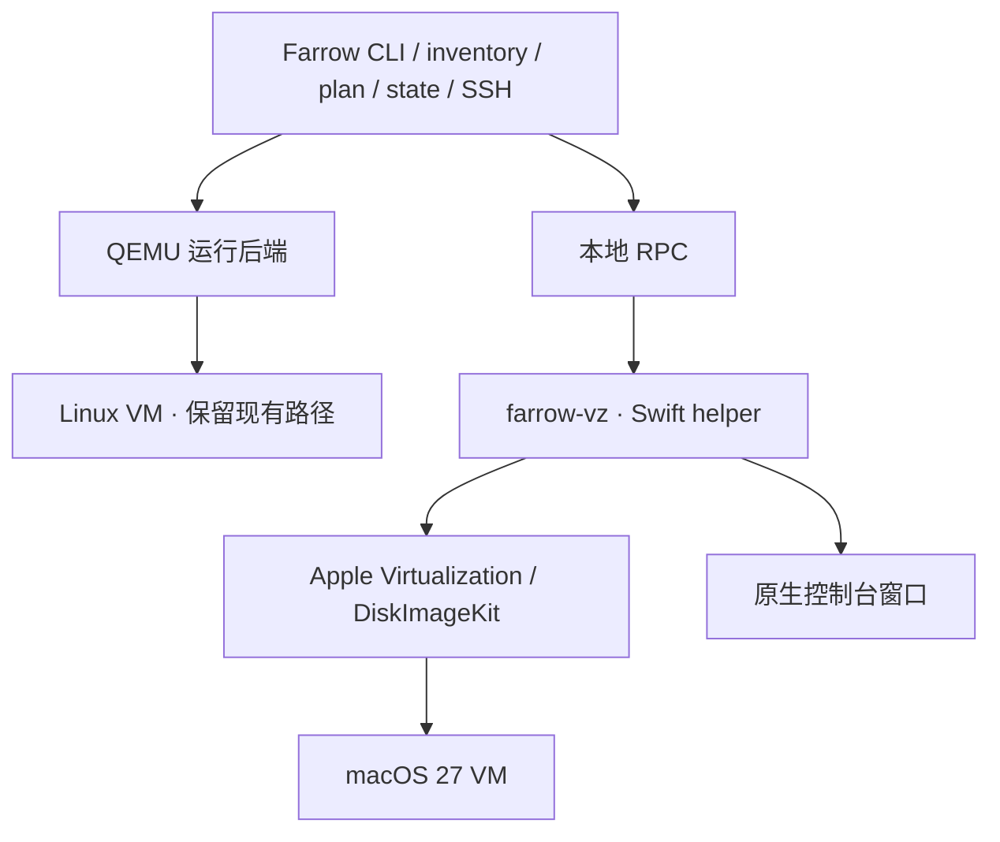

# Farrow 支持 macOS 虚拟机的可行性评估

调研日期：2026-09-21。Farrow 源码基线：`1c054a027420b5410c6f6feb344e27e001ae1af1`。

**建议立项，首个目标限定为 Apple Silicon + macOS 27 宿主 + macOS 27 Golden Gate 客户机。实现方式是在 Farrow 中增加 Apple Virtualization 支持。**

**产品设计更新：根据后续讨论，采用独立 `farrow mac` 入口、固定 mac1/mac2 两个槽位及独立状态、镜像、网络。本文第 3、6、7、9 节中共用 inventory/生命周期的初步建议已被[双槽位产品方案](MACOS-VM-PRODUCT-20260921.md)取代。新方案另含官方 IPSW 实测下载速度、DHCP 预留与 ASIF 分层磁盘探测。** 本文保留最初技术调研和开源项目证据，不应再把后面的 inventory 示例作为当前实施方案。

这次完成了当前 Farrow 源码检查、Apple 官方文档与许可核对、七个相关仓库的源码取证，以及本机 Apple API 探测。**尚未下载完整 IPSW、安装或启动 macOS 客户机，也没有实现 Farrow 新后端。** 下文明确区分已有能力、实际探测、设计建议和待验收项目。

## 1. 两个问题的结论

| 宿主与客户机 | 技术判断 | Farrow 产品判断 |
|---|---|---|
| Apple Silicon Mac / macOS → ARM macOS | Apple 官方支持；Golden Gate 属于可走此路径的系统 | 推荐支持 |
| 一台 Apple Silicon Mac 同时运行两个 macOS VM | 标准许可包含相应授权；现有工具也按两个并发实例的框架限制设计 | 作为首批验收场景 |
| Intel Mac → 旧版 Intel macOS | 有其他虚拟化方案，但不是 Apple Silicon 的 macOS VZ 路径 | 首版不纳入 |
| Intel Mac → Golden Gate | Apple 已不提供此版本的 Intel Mac 支持 | 不支持 |
| Linux x86_64 → Intel macOS | **技术上能运行**，OSX-KVM 等项目已经实现 | 不建议成为 Farrow 正式功能 |
| Linux x86_64 / ARM64 → Golden Gate ARM macOS | 未找到可作为产品依赖的官方或成熟通用方案；现有 Intel macOS/KVM 方案不能直接使用 ARM IPSW | **当前支持矩阵明确不支持** |
| Linux 控制端 → 远程 Mac 上的 macOS VM | 可以通过远程控制实现，但 VM 仍运行在 Mac 上 | 属于另一个后续功能 |

不能给出“Linux 绝对不能运行任何 macOS”的结论：这会与现有实现矛盾。准确结论是：**Linux 能通过非官方 QEMU/KVM 路线运行部分 Intel macOS；这不等于能可靠运行最新 ARM Golden Gate，也不等于获得 Apple 许可。** OSX-KVM 的 README 明确给出 Linux、VT-x/AMD SVM、QEMU 和 OpenCore 的组合。[OSX-KVM 源码与要求](https://github.com/kholia/OSX-KVM/tree/4c378a4b5e0b219783683012bec680325eb40719)

Apple 的 Golden Gate 兼容清单只列 Apple Silicon Mac。[Apple 系统兼容清单](https://support.apple.com/en-us/127255)

### 标准许可的实际边界

所查 macOS 27 标准 SLA 第 2B(iii) 条，允许在自己拥有或控制、已经运行 Apple 软件的 Apple 品牌电脑上，为开发、开发测试等列明用途运行最多两个额外虚拟实例；第 2J 条限制非 Apple 硬件运行及再分发。Linux 装在普通 PC 上不满足该授权；只把 Linux 装在 Apple 硬件上，也不能自动满足“已经运行 Apple 软件”的条件。特别书面或批量许可需另看适用条款。[macOS 27 SLA](https://www.apple.com/legal/sla/docs/macOS27.pdf)

因此，Farrow 的常规交付应是管理软件、安装配方与 Apple 官方下载入口；不能因为其他工具提供预装镜像，就推定 Farrow 可以公开镜像 macOS 系统文件。

### QEMU 的一个重要例外

不能再笼统说“QEMU 完全没有 ARM macOS 支持”。上游已有 `vmapple` 机器模型，但本次查看的 QEMU 11.1.50 文档仍要求 Apple Silicon、macOS 宿主，以及已经安装好的 macOS 12 VM，并明确不支持更新的客户机。它还需要 Apple 的启动环境。因此它不是 Golden Gate 支持方案，也不能证明 Linux 可以运行 Golden Gate。[QEMU VMApple 文档](https://www.qemu.org/docs/master/system/arm/vmapple.html)

本机 QEMU 11.1.1 的 `-machine help` 中没有 `vmapple`。Farrow 当前使用 `virt`/HVF 来运行 ARM Linux，现有配置不能直接换成 macOS 镜像。

## 2. Golden Gate 比旧版更适合 Farrow

macOS 27 新增 `VZMacGuestProvisioningOptions`，首次启动时可以提供：

- 用户全名、用户名、密码；
- 是否自动登录桌面；
- 是否启用 Remote Login，也就是 SSH。

**该能力要求宿主 API 可用，且客户机为 macOS 27 或更新版本；只在恢复安装后的首次启动生效。** 已经完成用户初始化的镜像不会因为再次传入参数而重置用户或密码。旧系统会忽略这些设置。[Apple 初始化接口](https://developer.apple.com/documentation/virtualization/vzmacguestprovisioningoptions)

限定首版宿主为 27 是产品范围选择，不是说所有旧宿主都不能启动 Golden Gate。旧宿主上的安装还涉及恢复镜像支持与 Device Support 版本；Apple 的 27 发布说明记录过 Xcode 27 beta 与较旧 Tahoe 组合的恢复安装问题。若要支持这些组合，应另列矩阵验收。[macOS 27 发布说明](https://developer.apple.com/documentation/macos-release-notes/macos-27-release-notes)

本次用 Xcode 27 编译的小型探测程序，已经在当前宿主成功构造并验证该配置。Swift 导入后的方法名为 `setGuestProvisioning(_:)`。这只是参数验证成功，不是客户机中的用户已经创建。

存储也有新变化：macOS 26 的 ASIF 稀疏镜像，在 macOS 27 可通过 DiskImageKit 组织成只读基础层与独立写入层。这使 Farrow 熟悉的“基础镜像 + 每台 VM 的增量写入”模式有了官方对应机制，但格式不是 qcow2。[DiskImageKit](https://developer.apple.com/documentation/diskimagekit)

网络方面，macOS 26 起的 `VZVmnetNetworkDeviceAttachment` 可以接入自定义 vmnet 网络。Apple 在 WWDC26 演示了用户初始化、自定义网络、端口转发与分层磁盘，说明这些能力可以用于正式虚拟化工具。[Apple WWDC26](https://developer.apple.com/videos/play/wwdc2026/224/)

### 本机实测数据

探测时间：2026-09-21 12:11:58，中国标准时间。

| 项目 | 返回结果 |
|---|---|
| 宿主 | macOS 27.0，build 26A428，arm64 |
| 宿主资源 | 128 GiB 内存，18 个逻辑 CPU |
| `VZVirtualMachine.isSupported` | true |
| macOS 27 用户初始化参数校验 | 成功 |
| 最新兼容恢复镜像 | macOS 27.0.0，build 26A428 |
| 恢复镜像硬件模型支持检查 | true |
| 最低客户机 CPU / 内存 | 2 vCPU / 4 GiB |
| Apple CDN HEAD | HTTP 200，支持 Range |
| IPSW 文件长度 | 26,626,436,228 字节 |
| 十进制 / 二进制大小 | 26.63 GB / 24.80 GiB |

镜像链接来自 `VZMacOSRestoreImage.latestSupported`，不是第三方站点推测：[Golden Gate 27.0 / 26A428 官方 IPSW](https://updates.cdn-apple.com/2026FallFCS/afcfc88e-bbe6-44bf-a5da-07c56eebc06c/UniversalMac_27.0_26A428_Restore.ipsw)。

完整证据：[探测输出](/Users/vonng/.codex/visualizations/2026/09/21/01a0c223-b874-7512-a4cb-6329d0df9ecf/macos-vm-research/host-probe.json)、[Swift 探测程序](/Users/vonng/.codex/visualizations/2026/09/21/01a0c223-b874-7512-a4cb-6329d0df9ecf/macos-vm-research/probe.swift)、[探测程序 entitlement](/Users/vonng/.codex/visualizations/2026/09/21/01a0c223-b874-7512-a4cb-6329d0df9ecf/macos-vm-research/probe.entitlements)。

## 3. Farrow 当前哪些地方需要改

本次源码检查确认，Farrow 并不存在一个已经可直接挂接 macOS 的通用运行后端；QEMU、qcow2 和 Linux 初始化逻辑进入了多个内部结构。

| 当前模块 | 已有假设 | 接入 macOS 的最小必要调整 |
|---|---|---|
| [平台选择](/Users/vonng/pgsty/farrow/internal/platform/platform.go:49) | 四种宿主 profile 都映射 QEMU；Mac 用 HVF，Linux 用 KVM | 同时考虑宿主和客户机类型，选择 QEMU 或 VZ |
| [启动参数](/Users/vonng/pgsty/farrow/internal/qemu/argv.go:1) | 唯一后端，必需 seed、QMP、日志等路径 | 保留此模块，新增 VZ 配置与运行进程 |
| [生命周期](/Users/vonng/pgsty/farrow/internal/vm/lifecycle.go:45) | QMP 查询 name/UUID，QMP powerdown/quit | 提取少量共同操作；VZ 以本地 RPC 返回实例身份和状态 |
| [状态文件](/Users/vonng/pgsty/farrow/internal/state/state.go:98) | 直接持久化 QEMU Invocation、QMP、Seed 等 | 增加后端判别与对应数据；迁移时保留旧节点可启动性 |
| [镜像目录](/Users/vonng/pgsty/farrow/internal/image/manifest.go:13) | 单文件、磁盘大小、boot、SHA256 等 | 区分恢复介质、已安装模板、运行实例；记录 macOS build 和硬件模型 |
| [磁盘管理](/Users/vonng/pgsty/farrow/internal/disk/disk.go:1) | 强制 qcow2 检查与 backing chain | 新增 raw/ASIF 处理，复用下载与校验基础能力 |
| [客户机初始化](/Users/vonng/pgsty/farrow/internal/cloudinit/render.go:796) | cloud-init、Linux UID/GID、GNU 工具、ext4/xfs、9p | 独立 Darwin 初始化与 readiness；不要让 macOS 走现有脚本 |
| [打包](/Users/vonng/pgsty/farrow/.goreleaser.yaml:14) | Go 主程序 CGO_ENABLED=0 | 单独构建、签名和打包 darwin/arm64 helper |

尤其要处理 Farrow 的 `dba` 身份契约：当前 Linux 默认 UID/GID 88，还验证 Linux 的 admin 组。macOS 可继续使用 `dba` 这个用户名，但应使用系统正常分配的本地用户身份及 admin/staff 组，不能机械复用 88:88。

Farrow 可以管理 macOS VM，并不代表 Pigsty 的 Linux 安装角色能运行在 macOS 上。混合 inventory 中应将 macOS 测试节点放在适当分组，分别选择适用的 playbook。

## 4. 开源项目与实现原理

以下结论基于本次固定到提交的源码，不能等同于这些仓库的每个正式发布版均已验证。七个仓库的完整 SHA 记录在[源码版本清单](/Users/vonng/.codex/visualizations/2026/09/21/01a0c223-b874-7512-a4cb-6329d0df9ecf/macos-vm-research/source-revisions.json)。

| 项目 | 本次所查许可 | 主要实现 | 对 Farrow 的价值 |
|---|---|---|---|
| Lume / trycua/cua | MIT | Swift CLI/API + Apple Virtualization；IPSW 安装、克隆、镜像仓库、显示 | 最接近 CLI 产品需求，可参考或选择性复用 |
| UTM | 主项目 Apache-2.0；附带 QEMU 等依赖另有许可 | QEMU 与 Apple Virtualization 两套后端，GUI 统一管理 | 参考多后端边界及桌面交互 |
| VirtualBuddy | BSD-2-Clause | Swift、Virtualization、安装器与桌面集成 | 参考原生窗口、恢复安装和客户机体验 |
| vfkit | Apache-2.0 | Go + Code-Hex/vz，VZ 设备配置与 REST 控制 | 可作低层启动进程，但不等于完整 macOS 安装管理器 |
| Code-Hex/vz | MIT | Go/cgo 对 Apple Virtualization 的封装 | 偏好 Go helper 时的候选，有 macOS 安装示例 |
| Tart | 当前为 FSL-1.1-ALv2 | Swift + VZ，OCI 镜像、CI、克隆、分层磁盘 | 产品能力值得参考；源码复用需要看具体版本的限制 |

许可来源：[Lume](https://github.com/trycua/cua/blob/9bbfa7dd3e27ca7f1861ede70aaca390174493f9/LICENSE.md)、[UTM](https://github.com/utmapp/UTM/blob/10799d9f462de5a2da2e4fcaeada9fd79d3ff7c4/LICENSE)、[VirtualBuddy](https://github.com/insidegui/VirtualBuddy/blob/b57aada086a5061eda26e73435bee9c31e418613/LICENSE)、[vfkit](https://github.com/crc-org/vfkit/blob/d125afdf5cc9311b962e6e619206e119ab74df21/LICENSE)、[vz](https://github.com/Code-Hex/vz/blob/0d35cf3a3a8b834ee3b5bf61e4946971b2c0d61a/LICENSE)、[Tart](https://github.com/openai/tart/blob/89017ff0b30c241cf50e5eef1f34b1701432ae1b/LICENSE)。

### Lume

Lume 本身没有实现 CPU 虚拟化。它创建 `VZMacPlatformConfiguration`、`VZMacOSBootLoader`、Mac 图形设备和 VirtIO 设备，安装阶段调用 `VZMacOSInstaller`。磁盘、NVRAM、硬件模型和机器身份被保存在 VM 目录中。[虚拟机配置实现](https://github.com/trycua/cua/blob/9bbfa7dd3e27ca7f1861ede70aaca390174493f9/libs/lume/src/Virtualization/VMVirtualizationService.swift)

克隆使用 APFS `clonefile`，跨卷不适用时退回复制，并更新 MAC 地址与机器标识。OCI 仓库保存的是真实 VM 磁盘和配置，包含压缩分块、摘要校验和缓存复用；这不是 macOS 容器。[本地克隆](https://github.com/trycua/cua/blob/9bbfa7dd3e27ca7f1861ede70aaca390174493f9/libs/lume/src/FileSystem/Home.swift)、[实例身份更新](https://github.com/trycua/cua/blob/9bbfa7dd3e27ca7f1861ede70aaca390174493f9/libs/lume/src/LumeController.swift)、[OCI 实现](https://github.com/trycua/cua/blob/9bbfa7dd3e27ca7f1861ede70aaca390174493f9/libs/lume/src/ContainerRegistry/ImageContainerRegistry.swift)

当前 README 提供的 `sequoia`/`tahoe` 无人值守预设，走的是离线挂载 APFS Data 卷、创建账户、跳过 Setup Assistant、开启 SSH 等步骤。源码内预设用户密码是 `lume/lume`；该默认值不应成为 Farrow 的长期凭据方案。README 仅明确 Tahoe 的 E2E 结果，不能据此宣称 Golden Gate 也通过了同样验证。[离线初始化代码](https://github.com/trycua/cua/blob/9bbfa7dd3e27ca7f1861ede70aaca390174493f9/libs/lume/src/Unattended/MacOSOfflineSetupPatcher.swift)、[Lume README](https://github.com/trycua/cua/blob/9bbfa7dd3e27ca7f1861ede70aaca390174493f9/libs/lume/README.md)

其 VNC 路径调用 `_VZVNCServer` 等私有接口。这能提供安装前后的显示，但存在系统升级兼容成本。Farrow 首版宜使用公开的 `VZVirtualMachineView` 原生窗口；需要远程桌面时再考虑客户机 Screen Sharing。[VNC 实现](https://github.com/trycua/cua/blob/9bbfa7dd3e27ca7f1861ede70aaca390174493f9/libs/lume/src/VNC/VNCService.swift)

直接包一层 Lume 是短期演示方案，但会引入第二套 VM 名称、目录、后台进程、状态和网络配置。它的 NAT/桥接选择也不能自动提供 Farrow 的固定 IP 私网契约。长期接入建议吸收必要实现，不把两个完整管理器叠在一起。

### UTM 与 VirtualBuddy

UTM 的 Apple Silicon macOS 路径是 `UTMAppleVirtualMachine` + Virtualization.framework；QEMU 路径是另一套管理实现。它证明 Farrow 增加并列后端是合理结构，不要求将 Linux 一起迁移到 VZ。[UTM 架构说明](https://github.com/utmapp/UTM/blob/10799d9f462de5a2da2e4fcaeada9fd79d3ff7c4/Documentation/Architecture.md)

UTM 的当前源码还使用新 vmnet API 管理 Apple 客户机网络。值得参考的是附件与网络对象的生命周期，而不是直接把整个 GUI 应用嵌入 Farrow。[UTM 网络实现](https://github.com/utmapp/UTM/blob/10799d9f462de5a2da2e4fcaeada9fd79d3ff7c4/Services/UTMAppleVmnetNetworkManager.swift)

VirtualBuddy 将 Mac 虚拟设备配置、恢复流程和 UI 分开，适合参考安装与本地控制台。它仍由 Apple 框架执行客户机。[VirtualBuddy 配置实现](https://github.com/insidegui/VirtualBuddy/blob/b57aada086a5061eda26e73435bee9c31e418613/VirtualCore/Source/Virtualization/Helpers/MacOSVirtualMachineConfigurationHelper.swift)

### vfkit / Code-Hex/vz

vfkit 有 `--bootloader macos`，要求提供机器身份、硬件模型与辅助存储，并支持本地 REST 控制。Code-Hex/vz 的示例还覆盖下载恢复镜像、构造硬件配置和执行安装。[vfkit 使用说明](https://github.com/crc-org/vfkit/blob/d125afdf5cc9311b962e6e619206e119ab74df21/doc/usage.md)、[vz 安装示例](https://github.com/Code-Hex/vz/blob/0d35cf3a3a8b834ee3b5bf61e4946971b2c0d61a/example/macOS/installer.go)

因此“Farrow 是 Go 项目，所以不能调用 Apple 框架”并不成立。但 Go/cgo 会改变构建条件，新 macOS 27 接口的封装覆盖也需要确认。对于首版就使用初始化和 DiskImageKit 新 API 的方案，独立 Swift helper 更直接。

### Tart

本次访问旧 `cirruslabs/tart` 地址会转到 `openai/tart`。当前 LICENSE 是 **FSL-1.1-ALv2**，限制竞争用途，并为每个版本规定两年后的 Apache-2.0 授权。不能按历史文章中的许可信息，或因为“能看到源码”，把当前版本当作无限制开源依赖。[当前许可证](https://github.com/openai/tart/blob/89017ff0b30c241cf50e5eef1f34b1701432ae1b/LICENSE)

其 OCI、Packer/CI 和克隆流程具有参考价值；当前文档已经描述 macOS 27 的 `clone --stacked` 与 ASIF 写入层，也区分了镜像缓存和真正可运行的磁盘组合。这对 Farrow 镜像设计有启发，但不是照搬代码的理由。[Tart 分层镜像说明](https://github.com/openai/tart/blob/89017ff0b30c241cf50e5eef1f34b1701432ae1b/docs/faq.md#stacked-disk-images)

## 5. 镜像应该如何管理

需要区分三类对象：

| 对象 | 用途 | 建议管理方式 |
|---|---|---|
| 恢复介质 `.ipsw` | 安装系统，不能当成已安装磁盘直接启动 | 按 version/build 缓存，来源优先 Apple CDN |
| 已安装模板 | 已完成恢复安装，可能尚未首次用户初始化 | 记录硬件模型、磁盘、辅助存储与初始化状态 |
| VM 实例 | 每台机器自己的可写系统盘和身份 | 独立写入层、独立辅助存储副本、独立机器 ID 与 MAC |

Apple 官方流程是读取 IPSW 的支持配置，创建磁盘和 Mac 平台配置，然后通过 `VZMacOSInstaller` 执行安装。[Apple 安装与启动示例](https://developer.apple.com/documentation/virtualization/running-macos-in-a-virtual-machine-on-apple-silicon)

### 下载策略

1. 使用 `latestSupported` 做初次发现，并允许指定本地 IPSW 或固定版本入口。
2. 将“latest”解析成确定的 version/build/URL，持久化到已应用状态，避免重跑悄悄换系统。
3. 复用现有下载进度、断点续传、原子落盘与摘要缓存，但使用恢复介质专用验证。
4. 由 Apple 安装接口判断映像与硬件配置是否适用；本地计算的 SHA256 可验证缓存一致性，但不能独自证明首次下载来源可信。
5. 用户自行下载到本机的 IPSW 可导入；Farrow 的公开目录可发布元数据和配方，系统文件默认由用户向 Apple 获取。

IPSW 只是第一笔空间开销。本次查到的 Golden Gate 下载已达 26.63 GB，不能用旧版“十几 GB”的经验估算。安装后的实际占用、临时恢复空间及 Xcode 数据，本次没有测量。

建议初始配置为 4 vCPU、8 GiB 内存、80–100 GiB 逻辑系统盘；Xcode 和大型构建缓存可从 150–200 GiB 逻辑盘规划。这些是工程容量建议，不是 Apple 最低值或实测占用。首次验证宜预留至少约 100 GiB 空闲宿主磁盘，再根据安装峰值修正；两台 VM 不能按 IPSW 大小乘二估算全部空间。

### 存储格式与克隆

最小实现可使用 raw 稀疏文件及 APFS 克隆。若宿主限定 macOS 27，优先验证 ASIF + DiskImageKit 的浅层 base/overlay 结构，能避免 raw 稀疏性在跨文件系统复制时丢失。当前 VZ 官方磁盘附件支持 raw/ASIF，不应把 qcow2 直接交给它。[VZ 磁盘格式](https://developer.apple.com/documentation/virtualization/vzdiskimagestoragedeviceattachment)

运行实例应保留：

```text
VM/
  config.json               # CPU、内存、网络、build、磁盘链等
  HardwareModel             # Apple 描述的虚拟硬件模型
  MachineIdentifier         # 此实例的 Apple 机器标识
  AuxiliaryStorage          # 此实例独立的辅助存储
  disk.asif                 # 或 raw / base + overlay
  runtime/                  # socket、PID、日志
```

同一实例重启必须恢复原有三项 Mac 平台信息；创建新实例时需要独立 machineIdentifier 和辅助存储，MAC 地址也应唯一。已有实例的辅助存储不能每次启动随意重建。[Apple 平台身份要求](https://developer.apple.com/documentation/virtualization/vzmacplatformconfiguration)

模板克隆还有两种不同语义：

- **尚未首次启动的模板**：可以尝试在每个克隆的第一次启动时使用官方 provisioning API。需要验收各副本的身份、辅助存储一致性和启动结果。
- **已经创建用户的模板**：新 provisioning 参数会被忽略。必须通过已有凭据或客户机 agent 更新 SSH 授权、主机名、网络和实例标识，并处理克隆的 SSH host keys。

OCI 可作为后续传输格式，存储磁盘层、配置和摘要。它解决分发效率，不改变虚拟机运行方式，也不自动解决 macOS 再分发授权。

## 6. 用户如何创建、登录与启动

Golden Gate 路径可设计为：

```text
解析 inventory → 获取固定版本 IPSW → 创建/克隆 VM
→ 恢复安装 → 首次启动传入账户与 SSH 配置
→ 获取管理地址 → 首次认证 → 安装 SSH 公钥
→ 设置主机名/固定 IP/共享目录 → 写入 readiness
→ farrow ssh / farrow exec 可用
```

官方 provisioning API 目前不是 cloud-init：它没有直接接收 Farrow 全套用户数据、SSH authorized_keys、任意脚本或固定 IP 的字段。因此首版仍需要一个明确的首次 SSH 配置阶段。

建议：

- 为每台 VM 生成独立初始化密码，存于 Keychain 或权限严格的本地凭据文件，避免写进 inventory、命令行或普通日志。
- 使用该凭据完成首次 SSH 登录，将 Farrow 公钥写入 `/Users/<user>/.ssh/authorized_keys`，随后用密钥连接。
- 保留 Farrow 的实例 UUID 信任命名空间，并把首次连接绑定到正确的 VM 网络身份；不能因换后端长期关闭 host key 校验。
- CLI 开发场景默认不必自动登录桌面；需要 GUI 自动化时再启用，并管理客户机自己的 Accessibility、Screen Recording 等权限。
- 基础本地账户和 SSH 不要求 Apple Account；iCloud、商店等是另外的登录流程。

GUI 应由运行该 VM 的 helper 持有 `VZVirtualMachineView`，Farrow 命令经 IPC 要求它显示窗口。不能假设另一个进程可以直接取得已有的 `VZVirtualMachine` 对象。后续可提供 `farrow console` 一类入口；这个命令名在此仅为设计建议。

“无窗口运行”可以作为目标，仍需保留虚拟显示设备配置。宿主无人登录、Keychain 锁定、机器重启后的后台运行，需要单独验收。Tart 文档记录了新系统上 Keychain 状态影响启动的情况，不能把交互式终端成功等同于 LaunchDaemon/CI 成功。[Tart 无人值守宿主说明](https://github.com/openai/tart/blob/89017ff0b30c241cf50e5eef1f34b1701432ae1b/docs/faq.md#headless-machines)

旧版 macOS 可先由用户通过 GUI 初始化一次，再导入为模板；Lume 的离线补丁、Packer 键盘自动化等都可以研究，但各版本维护成本高于 Golden Gate 的官方接口。首版没有必要同时覆盖所有历史系统。

## 7. 网络是 Farrow 接入的主要难点

Farrow 当前使用两类网络：QEMU user networking 负责管理 SSH/转发，socket_vmnet 私网提供 inventory 中的固定 IP。VZ 的默认 NAT 可以用于单机技术验证，但它不会自动满足整个 Farrow 私网契约。

### 先验证默认 NAT，再补齐固定 IP

单机 PoC 使用 `VZNATNetworkDeviceAttachment`，按实例 MAC 发现 DHCP 地址，验证 SSH 和桌面。这个阶段只能证明 VM 可用，不能作为 Farrow 完整功能发布。

固定 IP 的后续路径有两种：

| 路径 | 优点 | 必须解决的问题 |
|---|---|---|
| VZ 的 file-handle 网络接入现有 socket_vmnet | 更容易保留 Linux/macOS 共用 Farrow 私网的现有语义 | VZ 要 connected datagram socket；Farrow 当前 socket_vmnet 接口是 stream，需要有边界检查和背压的报文适配 |
| 新 vmnet API + VZVmnetNetworkDeviceAttachment | 官方网络对象，可自定义子网、DHCP 和转发 | entitlement、网络生命周期、跨进程共享、与既有 QEMU 私网的连接都需实现 |

不能直接把现有 stream FD 塞给 VZ：Apple 文档明确要求 datagram socket。[VZ file-handle 网络协议要求](https://developer.apple.com/documentation/virtualization/vzfilehandlenetworkdeviceattachment)

新 vmnet 路线也不是把一个不透明指针交给其他进程。SDK 要求正确的进程归属，Apple 提供网络对象序列化及经 XPC 在进程间重新建立对象的机制。配置要自己持久化，网络对象本身不跨进程退出存活。[Apple 网络对象接口](https://developer.apple.com/documentation/virtualization/vzvmnetnetworkdeviceattachment)、[WWDC 网络实现说明](https://developer.apple.com/videos/play/wwdc2026/224/)

直接使用 vmnet 的 `com.apple.vm.networking` 是受限制的 entitlement；Apple 文档要求虚拟化软件开发者联系 Apple 申请。采用已有受控网络 helper 与 file-handle 连接，可以把新 VZ runner 的依赖收窄，但仍要验证数据面。[Apple vmnet entitlement](https://developer.apple.com/documentation/bundleresources/entitlements/com.apple.vm.networking)

客户机内固定 IP 应通过 macOS 的网络配置机制设置，按网卡 MAC 找到正确服务，避免假设总是 `en0`。沿用双网卡设计时，管理网维持 DHCP，私网设置固定地址，避免两个默认路由相互覆盖。需要验证休眠恢复、DHCP 变化、宿主重启、共享目录和 Linux/macOS 互通。

## 8. 与当前 Linux 客户机的功能差异

| 方面 | Farrow 现有 Linux 路径 | macOS 路径 |
|---|---|---|
| 虚拟硬件与启动 | QEMU virt/q35、UEFI/磁盘引导 | Apple Mac 平台、Mac bootloader、硬件模型、辅助存储 |
| 安装输入 | 可直接启动的 cloud qcow2 | IPSW 恢复安装或已安装模板 |
| 用户初始化 | NoCloud/cloud-init | macOS 27 provisioning + 首次 SSH 配置 |
| 账户与命令 | /home、Linux UID/GID、GNU 工具 | /Users、本地目录服务、BSD 工具、zsh |
| 服务管理 | systemd 等 Linux 初始化体系 | launchd、LaunchDaemon/LaunchAgent |
| 系统卷 | 常见 ext4/xfs | APFS、只读系统卷与 Data 卷；有 SIP/TCC 等机制 |
| 目录共享 | 当前 QEMU/9p | VirtioFS，可从宿主共享目录挂载 |
| 数据盘 | qemu-img + Linux 格式化/挂载脚本 | VZ 块设备 + diskutil/APFS；独立实现，不套 Linux 的损坏恢复脚本 |
| 磁盘增量 | qcow2 backing chain | APFS 克隆，或 macOS 27 ASIF overlay |
| 控制与故障诊断 | QMP、串口、PID、SSH | VZ delegate/state、helper 日志、显示、SSH |
| 图形能力 | Farrow 当前以 CLI 为主 | 原生桌面与虚拟图形设备；图形能力不等于整块 GPU 直通 |
| USB | 取决于当前后端实现 | macOS 27 已有公开 Accessory Access/USB 传递机制，需用户选择设备 |
| iCloud | 无对应能力 | macOS 15+ 支持，但受创建方式、宿主身份和迁移影响 |
| 嵌套虚拟化 | 依宿主与后端条件 | 当前公开 Mac 平台 API 没有对应开关；不要承诺 VM 内 Docker Desktop/另一层 macOS |
| 快照 | 磁盘链与运行时状态各有实现 | ASIF 磁盘快照与内存状态保存是不同能力，需分别验收 |
| 休眠与后台运行 | 已有生命周期处理 | 还需检查 Keychain、GUI 会话、系统休眠与 VZ 状态 |

VirtioFS 支持可参考 [UTM 客户机说明](https://docs.getutm.app/guest-support/macos/)；它不是 Linux 9p 配置的直接复用。

iCloud 并非“所有 macOS VM 都无法登录”：Apple 从 macOS 15 提供相应支持，但老 VM 原地升级不自动获得同样能力，移动宿主或并发克隆可能要求重新认证。[Apple iCloud 文档](https://developer.apple.com/documentation/virtualization/using-icloud-with-macos-virtual-machines)

也不能使用旧资料中的“macOS VM 完全没有 USB”或“完全没有图形加速”概括当前系统。Golden Gate 的相关能力已发展，但 Metal 特性、GPU 计算、Apple Intelligence、DRM 和外设仍不能按裸机体验作保证；这些不应成为 Farrow 首版承诺。[Apple WWDC26 能力说明](https://developer.apple.com/videos/play/wwdc2026/224/)

保存内存状态之前需要调用框架的 save/restore 配置检查；不是所有设备组合都可保存恢复，也不能把运行中复制几个文件称为一致快照。[Apple save/restore 检查](https://developer.apple.com/documentation/virtualization/vzvirtualmachineconfiguration/validatesaverestoresupport())

## 9. 推荐实现结构与首版范围



建议由 Go 主程序继续负责配置、下载、状态、事务和 SSH；Swift helper 负责 Apple 对象、安装、运行、事件和窗口。每个 VM 的运行进程需要可核对的实例身份和独占锁，RPC 返回结构化状态及错误。跨进程的账户密码不放在 argv 中。

helper 至少需要 virtualization entitlement。面向用户分发时安排 Developer ID 签名、公证及版本匹配检查；开发时的 ad-hoc 签名探测成功，不等于分发包已经完成验收。

只抽取实际共有的操作：启动、查询、请求关机、强制终止、实例身份。安装恢复、首次用户初始化、Mac 图形等能力保留在专用实现中，避免先建设庞大的插件体系。

### 建议首版交付

- Apple Silicon/macOS 27 宿主，Golden Gate 27 客户机；
- Apple 官方 IPSW 下载或本地导入；
- 自动创建普通管理员账户、开启 SSH、配置 Farrow 公钥；
- `up/start/stop/status/destroy/ssh/exec` 语义与现有节点一致；
- 固定 IP、两台 Mac VM 互通，与 Linux 节点的混合网络；
- 本地原生控制台、目录共享；
- 关机状态下克隆，正确更新实例身份；
- 可恢复的安装与初始化状态，明确区分 running、SSH ready 与可选功能完成。

CPU/内存修改先要求关机。数据盘自动配置、内存快照、旧版客户机、USB 管理、远程 VM 调度和 OCI 分发可单独安排。它们不应拖住最有价值的 Golden Gate + SSH 开发场景。

对用户可以维持现有 inventory 形态，镜像元数据决定后端。例如下列仅是未来配置示意，**当前 Farrow 不支持 `macos27` 这个镜像引用**：

```yaml
all:
  vars:
    admin_ip: 10.10.10.10
    vm_image: macos27:26A428
    vm_cpu: 4
    vm_mem: 8192
    vm_disk: 100
  children:
    mac_nodes:
      hosts:
        10.10.10.10: { nodename: mac-1 }
        10.10.10.11: { nodename: mac-2 }
```

用户无需理解 HVF、VZ 或 IPSW 内部结构；但镜像来源、首次大下载、安装阶段与运行结果应清楚展示。

## 10. 实施顺序与验收

以下是粗略工程估计，不是经过排期的承诺：

| 阶段 | 验证内容 | 工作量量级 |
|---|---|---|
| 原型 | 一台 Golden Gate：恢复安装、官方账户初始化、SSH、公钥、窗口、关机再启动 | 约 3–5 个工程日 |
| 集成 alpha | Farrow 状态/命令接入、安装重试、固定 IP、双 VM、Linux 共存、克隆 | 约 2–4 个工程周 |
| 可分发版本 | 签名打包、网络权限路径、宿主重启/睡眠、升级和文档 | 约 1–2 个工程周，部分可与前阶段重叠 |

最大不确定项是网络接入、签名 entitlement，以及安装/首次启动的失败恢复。新后端上线之前，至少留下这些实际证据：

1. 固定到 27.0 / 26A428 的完整安装成功，记录时长与空间峰值。
2. 官方接口确实创建用户、启用 SSH；随后可以用 Farrow 公钥登录。
3. 第一次配置中断后，重跑不会重装已有成功节点，不误用失效密码。
4. 两个独立机器身份和 MAC 的 macOS VM 同时可用；处理其他工具占用并发额度的失败。
5. 固定 IP 在重新启动后保持，Mac/Mac 与 Mac/Linux 双向连通。
6. `stop/start` 不改变实例身份；`destroy/recreate` 正确刷新 SSH 信任。
7. 目录共享权限、只读模式与路径缺失均有正确结果。
8. 克隆不共写同一个系统盘或辅助存储，不继承错误的客户机信任身份。
9. 宿主重启、睡眠唤醒及 Keychain 锁定场景有明确行为。
10. 现有四种宿主构建和 Linux VM 路径回归通过；发布签名与实际用户安装分别验证。

原型首先要回答“能否把官方首次初始化真正跑通”。网络 PoC 再回答“能否保留 Farrow 固定 IP 与混合节点契约”。在这两项通过后，才把功能列入正式支持矩阵。

**建议决策：支持 macOS-on-macOS，优先 Golden Gate；Linux-on-macOS/Linux 保持现有实现；Linux 上的 Hackintosh 路径不纳入 Farrow 正式支持。**
