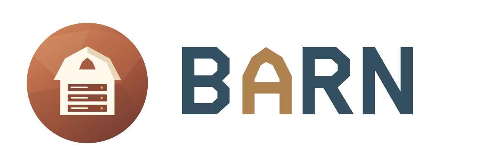

<h1 align="center">
  <a href="https://barn.pgsty.com/">
    <picture>
      <source media="(prefers-color-scheme: dark)" srcset=".github/barn-logo-dark.svg">
      
    </picture>
  </a>
</h1>

<p align="center">
  <strong>Bootstrap And Run Nodes</strong><br>
  Native virtual machines for macOS and Linux.
</p>

<p align="center">
  <a href="https://barn.pgsty.com/">Website</a> ·
  <a href="https://barn.pgsty.com/docs/start/tutorial/">Quick Start</a> ·
  <a href="https://barn.pgsty.com/docs/">Documentation</a> ·
  <a href="https://barn.pgsty.com/blog/">Blog</a> ·
  <a href="CHANGELOG.md">Changelog</a> ·
  <a href="CONTRIBUTING.md">Contributing</a> ·
  <a href="SECURITY.md">Security</a> ·
  <a href="https://barn.pgsty.com/zh/">中文</a>
</p>

<p align="center">
  <a href="https://barn.pgsty.com/"></a>
  <a href="https://github.com/pgsty/barn/actions/workflows/ci.yml"></a>
  <a href="https://github.com/pgsty/barn/releases/tag/v0.9.0"></a>
  <a href="go.mod"></a>
  <a href="LICENSE"></a>
</p>


## What is Barn?

Barn creates local virtual machines for development and testing:

- **Linux labs on macOS and Linux.** Describe up to 20 nodes in one
  Ansible-compatible YAML inventory. Barn starts QEMU VMs with fixed IPs,
  SSH access, and test data disks. Use the same inventory with
  [Pigsty](https://github.com/pgsty/pigsty) to deploy PostgreSQL and other services.
- **macOS machines on Apple Silicon.** `barn mac` creates named macOS 27 VMs
  with a native desktop, SSH, shared folders, and text clipboard sharing.
  Each machine has its own disk, credentials, and private subnet.

Linux uses QEMU with HVF on macOS or KVM on Linux. Mac guests use Apple's
Virtualization framework. Barn runs on your hardware and works independently
of Pigsty.

## Install 0.9.0

**macOS — Homebrew**

```bash
brew install pgsty/infra/barn
barn version
```

**Linux — download installer**

The installer selects the native arm64 or amd64 archive, verifies it, and
installs into `~/.local/bin` without sudo:

```bash
curl -fLO https://github.com/pgsty/barn/releases/download/v0.9.0/install.sh
BARN_VERSION=0.9.0 bash install.sh
export PATH="$HOME/.local/bin:$PATH"
barn version
```

Add the PATH line to your shell configuration when using the download installer.
DEB/RPM packages and manual archives are also available; see
[installation](https://barn.pgsty.com/docs/start/installation/) for requirements
and upgrades.

## Start a Linux lab

```bash
barn up
barn ssh
```

On a first interactive run, with no inventory or existing deployment, `up`
creates a one-node `barn.yml`, prepares host dependencies and networking,
downloads the verified Ubuntu 24.04 image, and waits for SSH. It shows host
changes and asks for administrator access when needed. Run `exit` to return
from the guest to your host.

The default VM has 2 vCPUs, 4 GiB of memory, a 64 GiB root disk, and a
128 GiB test disk at `/data`. Disk files grow as data is written.

To choose the configuration before booting, use `barn init` and edit the file.
`barn init full` generates four nodes. An existing Pigsty inventory works too:

```bash
barn plan -f pigsty.yml
barn up -f pigsty.yml
```

Barn prepares the machines; installing Pigsty services is a separate step.
Follow the [Linux quick start](https://barn.pgsty.com/docs/start/tutorial/).

## Run a macOS VM

macOS guests require Apple Silicon, macOS 27 or later, and `Barn Mac.app`.
The 0.9.0 release archives contain the CLI. Build the native component with
Xcode 27 using the [Mac guide](https://barn.pgsty.com/docs/start/macos/#install),
then run:

```bash
barn mac doctor
barn mac up
barn mac open
barn mac ssh
```

The first `up` asks before downloading Apple's restore image, verifies it,
and installs a reusable base. Later machines clone that base with independent
writable disks. Closing the desktop window keeps the VM running.

Name another machine with `barn mac up dev --cpu 8 --memory 16G`.
Apple allows two macOS VMs running at a time per Mac, including other tools.
Mac commands keep their state under `~/.barn/mac` and do not read `barn.yml`.
Linux `destroy` and `purge` leave Mac machines intact.

See the [Mac guide](https://barn.pgsty.com/docs/start/macos/) for native-component
installation, shared folders, desktop controls, and cleanup.

## Everyday Linux commands

| Task | Command |
|---|---|
| Inspect machines | `barn status` |
| Review inventory changes | `barn plan` |
| Create nodes or finish interrupted setup | `barn up` |
| Run a guest command | `barn exec meta -- hostname` |
| Stop / resume the lab | `barn stop` / `barn start` |
| Apply a changed VM definition | `barn recreate meta` |
| Delete a VM | `barn destroy meta` |
| Inspect available images | `barn image list` |
| Diagnose the host | `barn doctor` |

Barn keeps one Linux deployment per user under `~/.barn`. Changing directories
does not create another lab. Removing a host from YAML does not delete its VM;
destruction is explicit. Repeating `up` keeps healthy VMs running and retries
unfinished setup. `--json` and `--yaml` provide structured output for scripts.

**Use disposable test data.** Recreate replaces root and non-persistent disks.
During guest recovery, Barn may also reset an unrecognized or confirmed damaged
data filesystem, including one marked persistent. Persistence controls retention
across destroy/recreate, not backup or recovery of corrupt contents.
See [storage and access](https://barn.pgsty.com/docs/start/storage/).

## Documentation and help

- [Guides](https://barn.pgsty.com/docs/start/) — installation, daily operations, images, automation, and troubleshooting.
- [Reference](https://barn.pgsty.com/docs/reference/) — configuration, Linux and Mac commands, output, and exit codes.
- [Platforms and limits](https://barn.pgsty.com/docs/about/status/) — host requirements and guest restrictions.
- [Release notes](https://barn.pgsty.com/blog/release/0.9.0/) — what's new in 0.9.0.
- [Issues](https://github.com/pgsty/barn/issues) — bug reports and feature requests; use the [security policy](SECURITY.md) for vulnerabilities.

Use `barn --help` or `barn <command> --help` for the options in your installed version.

## Contribute

```bash
make build     # build the CLI and matching hosts helper into ./bin
make test      # unit tests
make check     # complete source checks
```

`make mac-build` builds the native Mac bundle with Xcode 27 on Apple Silicon.
See [CONTRIBUTING.md](CONTRIBUTING.md) for the development workflow, design rules,
and release tooling. Documentation lives in [barn.pgsty.com](https://github.com/pgsty/barn.pgsty.com).

## License

Barn is licensed under [Apache-2.0](LICENSE). Archives and packages include
the license texts for their Go dependencies.
